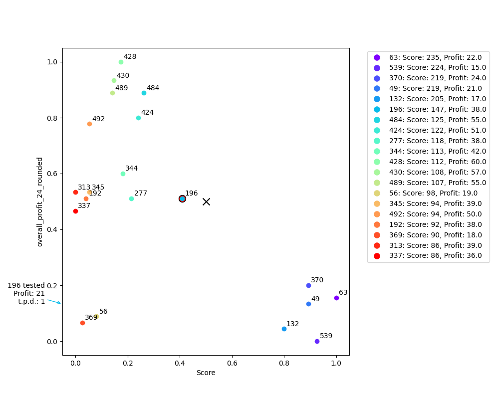

# Best Pair Trading

This code tries to find the best pair to trade now (or every hour) on binance.
It can automatically trade as well - but only use paper trading and never use this with real money!
The hyperopt can be used with different timeframes, it can plot the results and test the found strategy.

## Table of Contents

- [Installation](#installation)
- [Usage](#usage)
- [License](#license)

## Installation

Before installing the project, you need to set up your environment variables:

1. Copy the `.env.example` file to a new file named `.env`:

```bash
cp .env.example .env
pip install -r requirements.txt
```

2. Open the .env file and add your binance API details.

## Usage

The script can run without any parameters. But it needs to fill up some candle data etc. on your machine first.
To do this, start the hyperopt:

```bash
python3 hyperopt.py
```

But a better way (because of replicating) is to use start and end candles. F.e.:

```bash
python3 hyperopt.py --start_candle "2023-10-01 00:00" --end_candle "2024-01-14 12:00"
```

It will download candle data from binance from 1. of october 2023 until today.
It will split the data into 80% training and 20% test data.
It will run with default parameters to find the best values for this data.

Now you can check the plots and the result.
The plots are created automatically after the run, if you want to re-create them, just use this comand:

```bash
python3 plot.py --file_name df_params_2023-10-01_000459999000_2024-01-14_120459999000_train.pkl
```

Always use the "_train" File, the "_test" file will be automatically used, if available.
The Plot will look like this:



If you like it, you need to change trading.py to add these new parameters:

```python
min_percent_change_24 = 20
min_percent_change_1=0.5
max_percent_change_24=50
max_percent_change_1=2
needed_profit = 1.03
```

the dry_run should work for avoiding trades, but do not rely on it!!!

And start the trading:

```bash
python3 trading.py
```

## License

This project is licensed under the Creative Commons Attribution-NonCommercial 4.0 International (CC BY-NC 4.0) License. This means you are free to share and adapt the material as you see fit, under the following terms:

- **Attribution** — You must give appropriate credit, provide a link to the license, and indicate if changes were made. You may do so in any reasonable manner, but not in any way that suggests the licensor endorses you or your use.
- **NonCommercial** — You may not use the material for commercial purposes.

For more information, please see the [full text of the CC BY-NC 4.0 license](https://creativecommons.org/licenses/by-nc/4.0/).